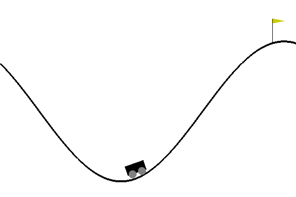

AA228-DecisionMakingUnderUncertainty
======================
Fall 2016 - class @ Stanford. Structure Learning, Markov Decision Process, Reinforcement Learning. Taught by Mykel Kochenderfer.

## Project 1 - Structure Learning
Three dataset of various size were made available. A Bayesian Score function has been coded and compared to the already implemented one. This function is used as a metric to judge the performance of the algorithms. A K2 and a local search algorithm have been implemented as well. The K2 has been used to generate an initial structure and the local search to refine this structure. 

## Project 2 - MDPs / Reinforcement Learning 
For that project, the objective was to learn the optimal policy for three different data sets. The first one is a classic 10x10 GridWorld problem. The optimal policy has been found using Value Iteration. The second data set has been obtained from https://gym.openai.com/envs (mountain-car_v0). The third data set structure has not been revealed. In the second and third case, a Q-Learning algorithm with eligibility traces have been implemented. 

## Final Project - Managing groundwater under uncertain seasonal recharge
Final project done in collaboration 
